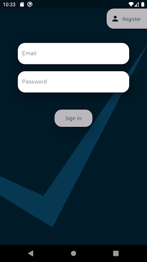
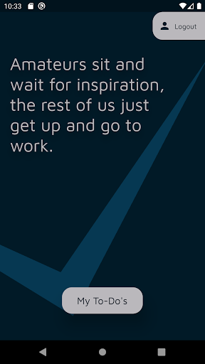
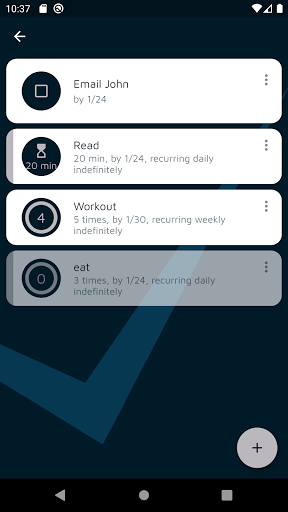
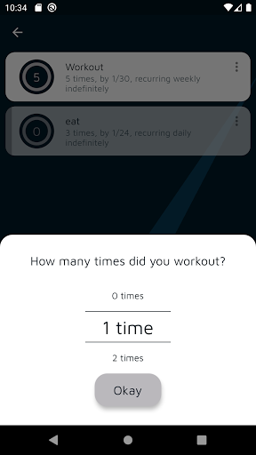
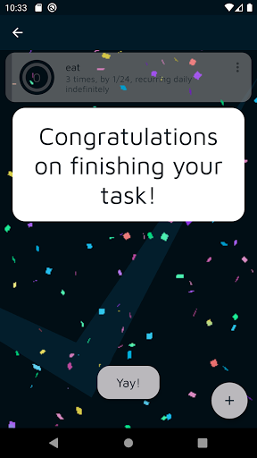
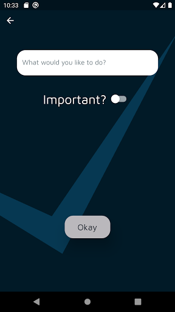
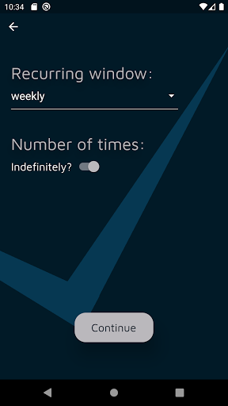
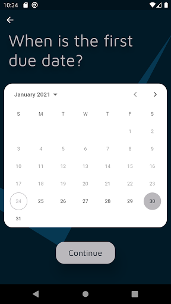

# retask

Retask is a to-do app specially designed for recurring goals. To-dos can be one-time tasks (email John), duration-based tasks (read for 20 minutes), or multiple-times tasks (workout 5 times).

The recurring functionality makes it easy to repeatedly reach your goals. Set goals like "Workout 5 times per week," or "Read for 20 minutes per day." Retask helps you track your progress towards your goal, celebrates the completion of your goal, and automatically resets your goal at the end of each recurring window (For example, week).

&nbsp;

Google Play Listing: https://play.google.com/store/apps/details?id=com.tbarmak.retask

&nbsp;

    
    
    
    
        
    
    
    

